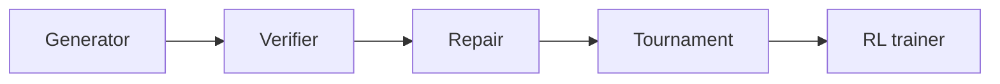

# Architecture

ProofScale is organized around a small set of modules that form a pipeline:

## Modules

| Module | Description |
|--------|-------------|
| `config` | Configuration for the proof tournament pipeline. |
| `data` | Dataset loading for proof tournament training and evaluation. |
| `generator` | Proof generation via transformer sampling with RL-guided decoding. |
| `main` | High-level orchestrator for the proof tournament pipeline. |
| `repair` | Proof repair: fixes flawed proofs using verifier error masks. |
| `rl_trainer` | PPO-style reinforcement learning trainer for the proof generator. |
| `tournament` | Tournament selection over a population of proof candidates. |
| `utils` | Data containers and utility functions for the proof tournament pipeline. |
| `verifier` | Proof verification: scores candidates for mathematical validity. |
