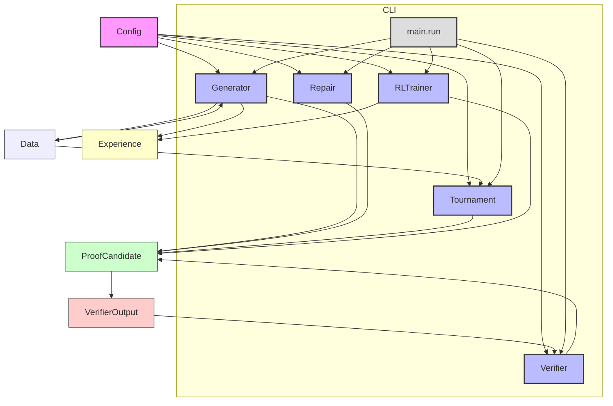

# Architecture – **llm_proof_tournament**

## 1. System Overview  

`llm_proof_tournament` implements the *population‑level test‑time scaling* pipeline for large language models that generate mathematical proofs.  
Given a list of theorem statements, the system:

1. **Generates** multiple proof candidates per statement (`generator`).  
2. **Repairs** partially corrupted candidates (`repair`).  
3. **Verifies** each candidate with a lightweight theorem‑checker (`verifier`).  
4. **Ranks** the population through a tournament‑style selection (`tournament`).  
5. **Learns** from the outcomes with a reinforcement‑learning loop (`rl_trainer`).  

All components are pure‑Python, stateless where possible, and wired together by a thin façade in `main.py`. The package follows a classic `src/` layout, exposing a clean public API (`src/llm_proof_tournament/__init__.py`) that can be imported as:

```python
from llm_proof_tournament import (
    Config,
    Data,
    Generator,
    Repair,
    Verifier,
    Tournament,
    RLTrainer,
    run,
    run_batch,
)
```

The architecture is deliberately modular so that each piece can be swapped (e.g., a different LLM, a more powerful verifier, or an alternative RL algorithm) without touching the rest of the code base.

---

## 2. Module Relationship Diagram  



*Arrows denote data or control flow. The `Config` object is the single source of truth for hyper‑parameters and is injected into every component.*

---

## 3. Module‑by‑Module Description  

| Module | Public API (excerpt) | Role |
|--------|----------------------|------|
| **`src/llm_proof_tournament/__init__.py`** | `from .config import Config`<br>`from .data import Data`<br>`from .generator import Generator`<br>`from .repair import Repair`<br>`from .verifier import Verifier`<br>`from .tournament import Tournament`<br>`from .rl_trainer import RLTrainer`<br>`from .main import run, run_batch` | Re‑exports the core classes/functions so users can import the package with a single statement. Also defines `__all__`. |
| **`config.py`** | `def load(cls, **overrides) -> Config`<br>`def as_dict(self) -> dict` | Holds all configurable hyper‑parameters (model name, temperature, tournament size, RL learning rates, etc.). `load` creates a `Config` instance from defaults + optional overrides; `as_dict` is useful for logging. |
| **`data.py`** | `def statements(self) -> List[str]`<br>`def proofs(self) -> List[str]` | Provides a thin wrapper around the benchmark dataset (e.g., a JSON file of theorem statements and reference proofs). The methods return raw strings; the dataset is read lazily to keep memory usage low. |
| **`generator.py`** | `def generate(self, statement: str, num_samples: int = 0) -> List[ProofCandidate]`<br>`def reward_baseline(self) -> float`<br>`def reward_baseline(self, value: float)`<br>`def get_parameters(self)` | Wraps the LLM inference API. `generate` returns a list of `ProofCandidate` objects (each holds the text, log‑probability, and a token‑level mask). The *reward baseline* is a moving average used by the RL trainer to compute advantage estimates. |
| **`repair.py`** | `def repair(self, candidate: ProofCandidate, mask: np.ndarray) -> ProofCandidate` | Takes a possibly corrupted proof and a binary mask (1 = keep token, 0 = replace) and re‑generates only the masked positions. This enables *localized* fixing without re‑sampling the whole proof. |
| **`verifier.py`** | `def score(self, candidate: ProofCandidate) -> VerifierOutput`<br>`def threshold(self) -> float` | Implements a fast, differentiable verifier (e.g., a small transformer that predicts “valid/invalid”). `score` returns a `VerifierOutput` containing a raw confidence and a calibrated probability. The `threshold` is the decision boundary used by the tournament. |
| **`tournament.py`** | `def select(self, population: List[ProofCandidate]) -> ProofCandidate`<br>`def select_top_k(self, population: List[ProofCandidate], k: int = 1) -> List[ProofCandidate]`<br>`def tournament_round(... )` | Conducts a single‑elimination tournament over a population of candidates. `select` returns the winner; `select_top_k` can be used for elitism. The round function handles pairing, scoring via `Verifier`, and optional mutation via `Repair`. |
| **`rl_trainer.py`** | `def add(self, exp: Experience)`<br>`def sample(self, batch_size: int) -> List[Experience]`<br>`def clear(self)`<br>`def step(self, batch: List[ProofCandidate]) -> dict`<br>`def update_policy(self) -> dict`<br>`def stats(self) -> dict` | Stores trajectories (`Experience` = (state, action, reward, next_state)) collected from tournament outcomes. Provides mini‑batch sampling, a `step` method that computes policy gradients, and an `update_policy` that applies the optimizer. `stats` reports learning curves. |
| **`utils.py`** | `def mean_log_prob(self) -> float`<br>`def tokenize(text: str) -> List[str]`<br>`def levenshtein(a: str, b: str) -> int`<br>`def calibrate_confidence(raw_score: float, temperature: float = 1.0) -> float` | Miscellaneous helpers: aggregation of log‑probabilities, a deterministic tokenizer (splits on whitespace/punctuation), a Levenshtein distance implementation for measuring proof similarity, and a temperature‑based calibration function used by the verifier. |
| **`main.py`** | `def run(self, statement: str) -> ProofCandidate`<br>`def run_batch(self, statements: List[str]) -> List[ProofCandidate]` | High‑level entry point used by the CLI and by downstream scripts. `run` orchestrates generation → repair → verification → tournament selection for a single theorem; `run_batch` processes a list in parallel (via `concurrent.futures`). |

---

## 4. Data Flow  

1. **Configuration** (`Config.load`) → all components.  
2. **Dataset** (`Data.statements`) supplies a theorem string.  
3. **Generation** (`Generator.generate`) creates *N* `ProofCandidate`s. Each candidate carries:  
   - `text` (the proof),  
   - `log_prob` (sum of token log‑probabilities),  
   - `mask` (optional binary mask for later repair).  
4. **Repair (optional)** – If a candidate’s verifier score falls below the threshold, `Repair.repair` is invoked with a mask that targets low‑confidence tokens. The repaired candidate replaces the original in the population.  
5. **Verification** – `Verifier.score` evaluates every candidate, returning a `VerifierOutput` containing:  
   - `raw_score` (logit),  
   - `prob` (calibrated via `utils.calibrate_confidence`).  
6. **Tournament** – `Tournament.tournament